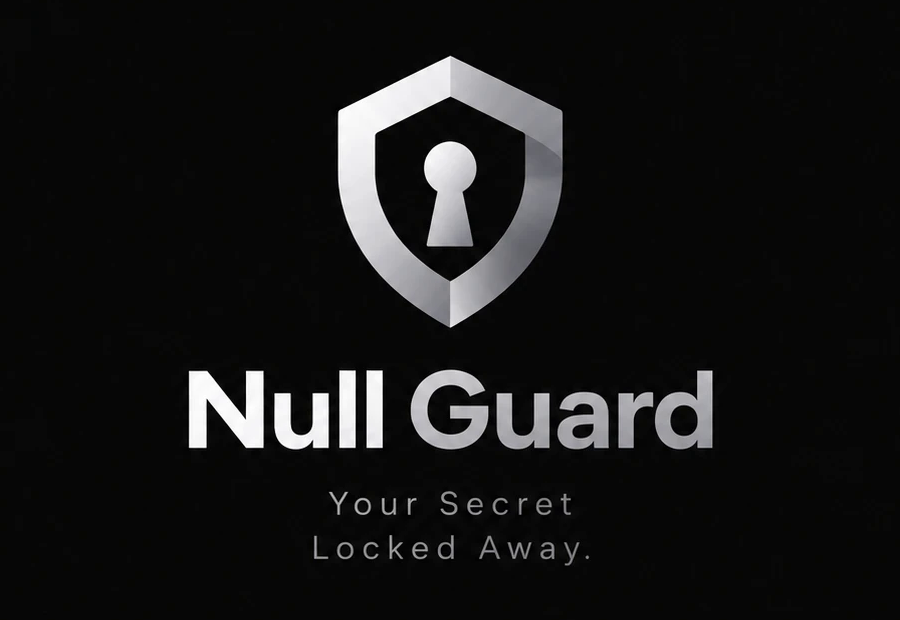

# Null Guard

**مدير كلمات مرور لويندوز يعمل على جهازك فقط — لا يتصل بالإنترنت إطلاقًا.**

خزنة مشفّرة لكل حساباتك، تفتحها بكلمة مرور رئيسية واحدة أو بـ Windows Hello (بصمة / وجه / رمز PIN).

## أهم ما يميّزه

- **محلي بالكامل:** لا خوادم، ولا حسابات، ولا مزامنة سحابية.
- **تشفير قوي:** Argon2id لاشتقاق المفتاح + XChaCha20-Poly1305 للتشفير المُصادَق.
- **يسد تسريبات ويندوز:** كلمات المرور المنسوخة لا تدخل سجل الحافظة (Win+V) وتُمسح تلقائيًا، ومحتوى النافذة لا يظهر في لقطات الشاشة ولا في مشاركة الشاشة، ومفتاح الخزنة لا يُكتب على القرص.
- **يُقفل تلقائيًا** عند الخمول، وعند قفل الشاشة أو سكون الجهاز.
- **واجهة عربية وإنجليزية**، مع وضع ليلي ونهاري.

## التحميل والتثبيت

1. من صفحة [**Releases**](../../releases/latest) حمّل ملف التثبيت الذي ينتهي بـ `_x64-setup.exe` (أحدث إصدار دائمًا في الأعلى).
2. انقر عليه نقرتين. إن ظهر تحذير SmartScreen: **More info** ← **Run anyway** (البرنامج غير موقّع بشهادة مدفوعة).
3. اضغط **Install**، وسيظهر البرنامج في قائمة ابدأ.

**المتطلبات:** ويندوز ١٠ (إصدار 2004 أو أحدث) أو ويندوز ١١.

## ⚠️ تنبيه مهم: قبل تحديث البرنامج أو نقله — حافظ على كلمات مرورك

خزنتك محفوظة **على جهازك فقط**، في مجلد منفصل عن البرنامج (`%LOCALAPPDATA%\NullGuard`). اتبع هذه الخطوات حتى لا تضيع كلمات مرورك:

### عند التحديث إلى إصدار أحدث

1. **قبل التحديث صدّر نسخة احتياطية:** الإعدادات ← البيانات ← **«تصدير نسخة مشفّرة»**، واحفظ الملف على فلاشة أو مكان آخر، وتذكّر كلمة مرور التصدير.
2. **ثبّت الإصدار الجديد فوق القديم مباشرة.** لا تحتاج إلغاء تثبيت القديم أولًا.
3. افتح البرنامج بكلمة المرور الرئيسية نفسها، وتأكد أن حساباتك كلها موجودة.

- التحديث لا يلمس الخزنة، وإلغاء التثبيت لا يحذفها (حتى لو اخترت حذف بيانات التطبيق).
- **لا تحذف المجلد `%LOCALAPPDATA%\NullGuard` أبدًا** — فيه خزنتك (مشفّرة) ونسخها الاحتياطية.

### عند الانتقال إلى جهاز جديد، أو إعادة تثبيت ويندوز، أو فرمتة الجهاز

1. على الجهاز القديم: **«تصدير نسخة مشفّرة»** إلى فلاشة.
2. على الجهاز الجديد: ثبّت البرنامج وأنشئ خزنة، ثم الإعدادات ← البيانات ← **«استيراد نسخة»**، واختر الملف واكتب كلمة مرور التصدير.

- إعادة تثبيت ويندوز أو الفرمتة **تمسح الخزنة**؛ النسخة المصدَّرة هي الشيء الوحيد الذي يعيدها.
- Windows Hello مرتبط بالجهاز: فعّله من جديد على الجهاز الجديد. كلمة المرور الرئيسية هي التي تفتح الخزنة دائمًا.

### إن كان البرنامج على فلاشة (الوضع المحمول)

خزنتك في المجلد `NullGuard-data` بجوار البرنامج على الفلاشة. للتحديث: ثبّت الإصدار الجديد على الكمبيوتر، ثم انسخ `nullguard.exe` من `%LOCALAPPDATA%\Null Guard` إلى الفلاشة **فوق** `NullGuard.exe` القديم. **لا تحذف `NullGuard-data` ولا `NullGuard-portable.txt`.**

## الحقوق

البرنامج **مجاني للتحميل والاستخدام الشخصي**، لكنه **ليس مفتوح المصدر**: الكود المصدري غير منشور، وجميع الحقوق محفوظة للمطوّر.

> روابط **Source code** التي يضيفها GitHub تلقائيًا تحت كل إصدار لا تحتوي إلا هذا الملف — لا كود فيها.

---

# Null Guard (English)

An offline, zero-knowledge password manager for Windows. Your vault stays on your machine: no servers, no accounts, no cloud sync.

- Argon2id key derivation + XChaCha20-Poly1305 authenticated encryption
- Copied passwords are excluded from clipboard history and cloud clipboard, then auto-cleared
- Window content is excluded from screenshots and screen sharing
- Auto-lock on idle, screen lock and sleep; Windows Hello unlock
- Arabic and English UI, light and dark themes

**Download:** [latest release](../../releases/latest) · **Requires:** Windows 10 (2004+) or Windows 11

**⚠️ Before updating or moving — keep your passwords:** export an encrypted copy first (Settings → Data → Export an encrypted copy) and keep it on a USB drive. Install the new version *over* the old one; your vault lives in `%LOCALAPPDATA%\NullGuard`, which updates and uninstalls never touch — never delete that folder. Reinstalling Windows or formatting erases it: on the new system, create a vault and use *Import a copy*. Windows Hello must be set up again on a new device. Portable (USB) mode: copy the new `nullguard.exe` over `NullGuard.exe` on the drive and keep `NullGuard-data` and `NullGuard-portable.txt`.

**License:** free to download and use. Not open source — the source code is not published; all rights reserved. The automatic "Source code" archives on each release contain only this README.

---

## ⚠️ إخلاء المسؤولية

- **نسيان كلمة المرور الرئيسية:** لا توجد أي طريقة لاسترجاعها، ولا لفتح الخزنة بدونها — لا عندنا ولا عند أي أحد. إذا نسيتها ضاعت بياناتك، **ونحن غير مسؤولين عن ذلك إطلاقًا**.
- **حذف كلمات المرور أو ضياعها:** **نحن غير مسؤولين تمامًا** عن ضياع كلمات مرورك أو حذفها لأي سبب: حذف ملف الخزنة، أو عطل الجهاز، أو إعادة تثبيت ويندوز، أو فيروس. احتفظ بنسخة احتياطية مشفّرة (الإعدادات ← تصدير).
- باستخدامك البرنامج فأنت توافق على ما سبق.

**Disclaimer:** There is no way to recover a forgotten master password or to open the vault without it. If you forget it, your data is lost, and we are not responsible. We are also not responsible for lost or deleted passwords for any reason (deleted vault file, device failure, reinstalling Windows, malware). Keep an encrypted backup (Settings → Export). By using the program you accept these terms.
